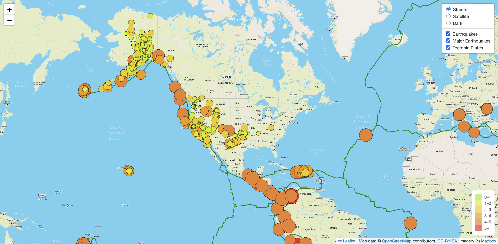
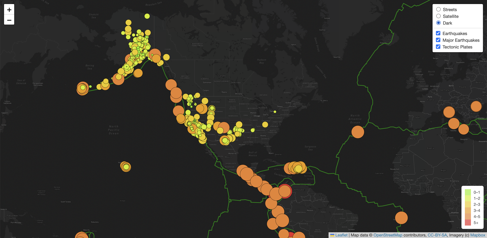
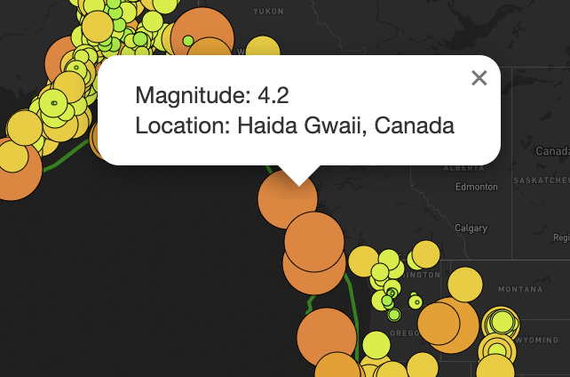

# Mapping Earthquakes

## Overview of Project

### Purpose

The purpose of this project is to visualize and map earthquake data from the past 7 days in a webpage. Each earthquake is marked by a circle marker, with a radius and color dependent on the **magnitude** of the earthquake. When you click on a circle marker, a popup displays some information about the earthquake. 

There are many different folders for this project, but within the [earthquake_challenge folder](/earthquake_challenge) lies the culmination of the project.

### Tools

- HTML
- JavaScript
- CSS
- D3 Library
- Leaflet Library
- Mapbox API

### Usage Restrictions

If anyone wishes to use code from any folder, you will need to create your own `config.js` file within whichever `*/static/js` folder you run the `index.html` file from. You will need to have your own `Mapbox API Token`. The `config.js` file should only contain the following line of code:

```javascript
const API_KEY = "YOUR MAPBOX API TOKEN HERE"
```

## Results

### Display

Default street display style:<br>


Satellite display style:<br>


Dark display style:<br>


Popup Information display:<br>

